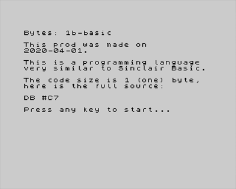

# 1b-basic

This is a wild demo (demoscene) for ZX-Spectrum 48 / 128 or compatible.

- pouet: http://www.pouet.net/prod.php?which=85125

## Compilation dependencies

- SJAsmPlus - https://github.com/sjasmplus/sjasmplus
- BAS2TAP - https://github.com/andybalaam/bas2tap
- Ruby - https://www.ruby-lang.org/en/
- zEmu - https://github.com/restorer/zemu (optional)
